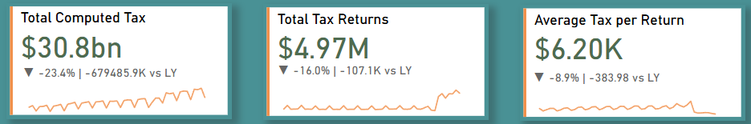
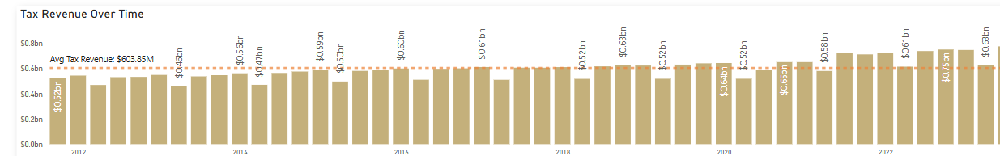
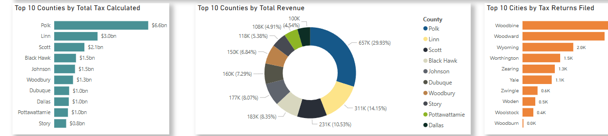

# SalesTax Intelligence

**SalesTax Intelligence** is a comprehensive data analysis and machine learning project designed to analyze and predict sales tax patterns, classify counties or cities based on tax contributions, perform forecasting, and cluster counties for segmentation. The project integrates data wrangling, machine learning, and visualization tools like **SQL**, **Power BI**, and **Excel** to deliver actionable insights to stakeholders.

The project includes the following:
- **ETL pipeline** to clean and prepare the data for analysis.
- **Machine Learning models** for regression, classification, clustering, and anomaly detection.
- **Power BI Dashboard** for interactive data visualization.

---

## Features

- **Sales Tax Prediction**: Predicts computed tax values based on taxable sales data using a Random Forest regression model.
- **Economic Segmentation**: Clusters counties into distinct groups based on their sales tax data using K-Means and DBSCAN clustering.
- **Interactive Dashboard**: Power BI dashboard for visualizing trends, insights, and the results of the machine learning models.
- **Time Series Forecasting**: Project tax revenue for budgeting and planning using Holt-Winters Exponential Smoothing.

---

## Project Overview

This project involves the following steps:
1. **Data Extraction**: Extract data from an Excel sheet containing tax-related information for various counties and cities.
2. **Data Transformation**: Perform data cleaning, transformation, and feature engineering using SQL and Python.
3. **ETL Pipeline**: Implement ETL processes to clean, aggregate, and transform data before loading it into Power BI.
4. **Machine Learning Models**: Develop and train models for tax prediction (regression), clustering (economic segmentation), and time series forecasting.
5. **Power BI Dashboard**: Create an interactive dashboard to visualize trends and insights.

---
## 💻 Sample Dashboard Screenshots

Here are some sample screenshots of the Power BI dashboard visualizations:

*Figure 1: KPI Cards for Total Tax, Taxable Sales, and Average Tax per Return.*

*Figure 2: Line Chart showing tax trends over time (Month vs Computed Tax)..*

*Figure 3: Bar Chart and Pie-chart comparing tax performance across counties.*

---
[Download the dataset](https://catalog.data.gov/dataset/quarterly-retail-sales-tax-data-by-county-and-city)

---

